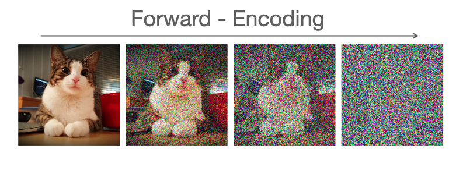
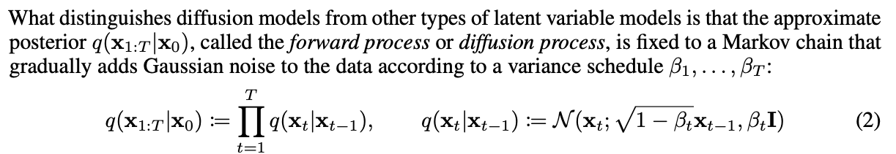
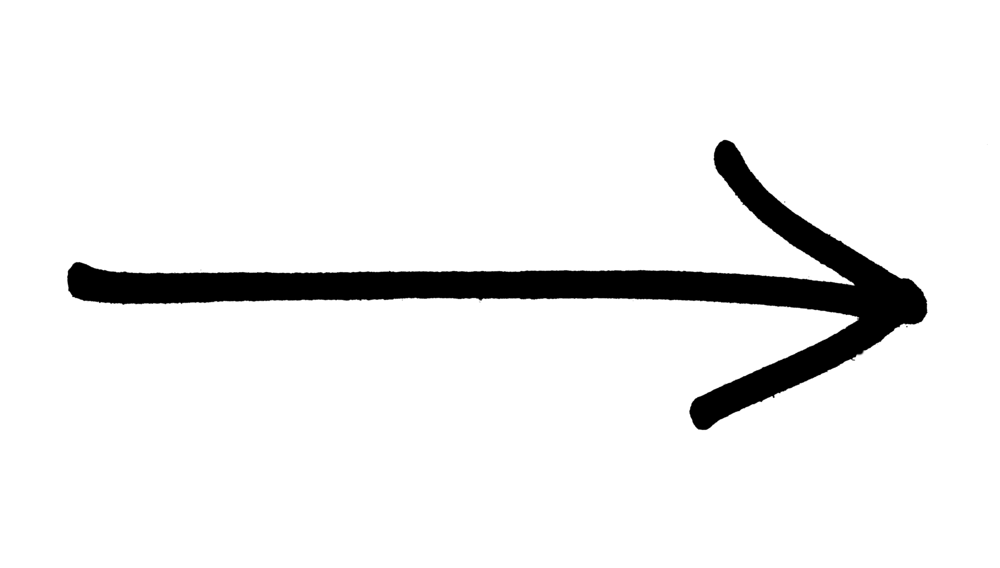

class: middle
count: True
# Inductive Bias in
#Deep Probabilistic Modelling
## Antoine Wehenkel
#### PhD Defense

.absolute.top.left.width-40[]
.absolute.top.right.width-15[]
---
# The Story Behind

.center.width-100[]

???
When I was younger I wanted to become neurologist,
I wanted to understand how the brain works and repair it if possible.
Eventually, I gave up and found that I was more in love with maths than biology at the school.
But then, in preparing this presentation I found there was strong connections between my childhood's dreamjob and the research I did during this PhD. At a high level the goal is the same, understand how things can be intelligent and can act so in the real-world. When I was a child the reason was to help people with brain illness, now it is to create robot that will replace us.. I am joking. Hopefully, artificial intelligence can have a positive impact on the real-world.

---
# Context
.width-100[]

???

Now for the next 55 minutes of presentation, my promise is to present some work I did during the past four years to help computer become more intelligent.

---
# *Today's menu*
 
.center[
## *Entree*
## The Why and How of Modelling
## *Plat*
##  Deep Probabilistic Modelling
## *Dessert*
##  Contributions
]

???
To this purpose, I will first  spend some time to abstract what is intelligence, how we human, make informed choice in order to achieve a goal.

- One key aspect for intelligence are models. I will explain why this is the case and how we use them.
- Then I will start to be more technical and present different Algorithmic techniques to define models thanks to deep neural networks.
- Finally I will expose some contributions I made to the development of artificial intelligence with neural networks.
---

class: section

# The Why and How of Modelling

---

.important[.center[A model is a simplified representation of the reality.]]

.center.width-90[]

.footnote[Source GIF: [Newtonian Gravity: Crash Course Physics #8](https://www.youtube.com/watch?v=7gf6YpdvtE0&ab_channel=CrashCourse)]

???
*It allows us to reason, and potentially to achieve an objective.*

---
# Motivation

.center[
<video frameborder="0" width="800"  controls>
  <source src="figures/1000USD_catch_ball.mp4" type="video/mp4"  controls>
</video>
]

???
- This could really happen to you if you walk in the street. I hope 1000$ motivates you to listen for the next hour.

- You look at the ball and then you identify the horizontal speed of the ball in order
to decide where to move to manage catching the ball.

- So internally you abstract many things, for instance you would not consider that a bird could crash into the ball
 modifies its movements. Rather you suppose the horizontal speed is constant, or maybe its very windy and you evaluate and consider its effect as well.  

---

Video with the trajectory of the ball and newton's equation.

???

We can automate this reasoning by considering newton's law and predict where the ball shall go.

---

# Inference

.important[.center[Draw logical consequences from assumptions.]]

--

.grid[.kol-6-12[
.width-100[]
]
.kol-6-12[
Plot that shows the evolution that could happen.
]]

???

Here the assumptions are:
- The newton's law is accurate enough to describe the evolution of the system.
- The initial evolution of the ball
- The mass of the ball is constant
- The force is a simple function, maybe even a constant equal to the gravity.

In order to predict the ball position at height for which we will be able to catch it.
We must performe inference. That is we must predict the ball horizontal speed and maybe also its vertical speed
in order to chose if we have to run or just walking is fine. If we neglect the wind this means...

---

# Model Discovery

.center.circle.width-40[]
--
count: false
.center[
Galileo Galilei (1564 - 1642)
]

???
This shows how building mathematical model can help us automate tasks that require reasoning.
Clearly, the goal is to write down in formal terms what is happening when we solve tasks with our brain.

---
# Box's Loop

.avatars[.circle.width-100[]]

.center.width-100[]

---
# Box's Loop in Science
.avatars[.circle.width-100[]]

## The first scientific atomic model: *John Dalton in 1803.*

.center.width-80[]

--

.center.width-80[]

???
1803

Fails to explain that atoms seems made of positive and negative charges that are observed when we bend

---
# Box's Loop in Science
.avatars[.circle.width-100[]]

## Electrons and protons: *JJ Thomson in 1897.*

.grid[
.kol-4-12[.center.width-90[]
]]
---
count: false

# Box's Loop in Science
.avatars[.circle.width-100[]]

## Electrons and protons: *JJ Thomson in 1897.*

.grid[
.kol-4-12[.center.width-90[]
]
.kol-8-12[.center.width-100[]
]
]

???
1897
plum pudding model
---
# Box's Loop in Science
.avatars[.circle.width-100[]]

## The nucleus: *Ernest Rutherford in 1911.*
.grid[
.kol-4-12[.center.width-90[]
]]
???
1911
---
count: false

# Box's Loop in Science
.avatars[.circle.width-100[]]

## The nucleus: *Ernest Rutherford in 1911.*
.grid[
.kol-4-12[.center.width-90[]
].kol-8-12[.center.width-90[]
]]
???
1911

---
# Box's Loop in Science
.avatars[.circle.width-100[]]

## Discrete energy levels: *Niels Bohr in 1913.*

.grid[
.kol-4-12[.center.width-90[]
]]

--
.avatars[.circle.width-100[] .circle.width-100[]]

## Uncertainty on the electrons positions and speeds: *Erwin Schrödinger in 1926.*

???
Quantization of atoms.
allows to predict the properties of the atoms. It explains the Mendeleiv table.
1915

---
# Box's Loop in Machine Learning
## A model for translation:
## *Describe formally the relationship between languages.*

.center.width-80[]

???

- What if we do not have a good understand of the system studied?
- If we cannot rely on years of research and smart people finding elegant way to describe it?
- This is where machine learning can help.

- We also have a model but it is not as constrained as the one we would use in science
- We rather have many parameters

---
count: false

# Machine Learning
## A model for translation:
## *Describe formally the relationship between languages.*

.center.width-80[]

???

- What if we do not have a good understand of the system studied?
- If we cannot rely on years of research and smart people finding elegant way to describe it?
- This is where machine learning can help.

- We also have a model but it is not as constrained as the one we would use in science
- We rather have many parameters
---
count: false

# Box's Loop in Machine Learning
.grid[
.kol-9-12[## A model for translation:
.important[Use large amount of data to infer the parameters of a very expressive model.]
].kol-3-12[.center.width-100[]]
]

.center.width-70[]

???

- What if we do not have a good understand of the system studied?
- If we cannot rely on years of research and smart people finding elegant way to describe it?
- This is where machine learning can help.

- We also have a model but it is not as constrained as the one we would use in science
- We rather have many parameters

---
# Probabilistic Modelling
.important[Probabilistic models embed notions of randomness or uncertainty with the language of probability.]

Express a probabilistic model on the rugby ball.

Plot of the rugby ball that shows how the uncertainty about the initial position evolve as we observe the positions
Plot of the corresponding uncertainty on its final position.

???
Effective framework to create and analyze models in front of data.
Combined with algorithms it allows computers to analyze data in front of models
in a flexible way. In the end both scientific models and machine learning
models try to achieve the same goal... Create an abstract representation of a real-world phenomenon
with mathematical terms such that we can confront it to data and make prediction with it

---
# The curse of dimensionality

- Show

.center.width-100[]

???

The curse of dimensionality, the necessity of defining a meanigful class of Models
It is impossible to learn if we do not make some assumptions.
For some problems we cannot accumulate a lot of data.

---
# Graphical Models

Raccrocher à l'example

???
One way of representing these models is with a graphical structure that denotes
independence assumptions we suppose reasonable.

---
class: section

# Deep Probabilistic Modelling

---
# Neural Networks

.center.width-100[]

---
count: false

# Neural Networks

.center.width-100[]

---
count: false

# Neural Networks

.center.width-100[]

---
count: false

# Neural Networks

.center.width-100[]

---
count: false

# Neural Networks

.center.width-100[]

---
# Deep Probabilistic Models

.important[Parameterize a probabilistic model with neural networks.]

Learning aim at finding the parameters of the neural network that encode the distribution observed in the data.

---

# Variational auto-encoder
.center.width-100[]

--
count: false

## Objective:
$$
\max\_\{\theta} \sum\_{x \in \mathcal{D}} \\log p\_\\theta(x)
$$
???
Raccrocher à l'example
---
count: false

# Variational auto-encoder

.center.width-100[]

--
count: false

## Objective:
$$
\begin{aligned}
\max\_\{\theta, \\psi\} \\log p\_\\theta(x)=&\max\_\{\theta, \\psi\}\log \mathbb{E}\_{p\_\psi(z|x)}\left[ \frac{p\_\theta(x | z) p(z)}{p\_\psi(z|x)} \right]\\\\
\geq &\max\_\{\theta, \\psi\}\mathbb{E}\_{p\_\psi(z|x)}\left[ \log \frac{p\_\theta(x | z) p(z)}{p\_\psi(z|x)} \right]
\end{aligned}
$$

???
Raccrocher à l'example
---
# Diffusion models

.center.width-100[]
---
count: false
# Diffusion models

.center.width-100[]
.center.width-50[]

---
# Normalizing flows

.important[A normalizing flow is a *bijective function* used to model a *probability distribution* via a *change of variables*.]

.center[.width-100[]]

.center[$ p(\mathbf{x}; \mathbf{\theta}) = p\_\mathbf{z}(f(\mathbf{x}; \mathbf{\theta})) \left| \det J\_f(\mathbf{x}; \mathbf{\theta})\right|, \quad f(.;  \mathbf{\theta}): \mathbb{R}^d \rightarrow \mathbb{R}^d$ a neural network.]

.footnote[https://lilianweng.github.io/lil-log/2018/10/13/flow-based-deep-generative-models.html]

???
Raccrocher à l'example

---
class: section

# Contributions

---
# Graphical Normalizing Flows
## How to define a bijective function with a neural network $f$?

--
## $f(\mathbf{x}) = \begin{bmatrix} f_1(x\_1; \mathbf{c}_i(\mathbf{x})) & ... & f_d(x\_d; \mathbf{c}_d(\mathbf{x})) \end{bmatrix}^T.$
--
count: false
## *Sufficient condition:* $\left| \det J_f(\mathbf{x}; \mathbf{\theta})\right| > 0 \quad \forall \mathbf{x} \in \mathbb{R}^d.$
--

## *Note*: $\det J_f(\mathbf{x}) = J_f(P(\mathbf{x}))$ for any permutation $P$.

--
## *Idea:* Make $J_f$ triangular (up to a certain permutation $P$) $\Rightarrow \det J\_f = \prod^d\_1 \frac{d f\_i}{d x\_i}.$

--
## $\frac{d f\_i}{d x\_i} > 0 \Rightarrow \det J_f(\mathbf{x}) > 0.$

---
# Graphical Normalizing Flows
## *What is $f$?* $f(\mathbf{x}) = \begin{bmatrix} f_1(x\_1; \mathbf{c}_i(\mathbf{x})) & ... & f_d(x\_d; \mathbf{c}_d(\mathbf{x})) \end{bmatrix}^T.$
## $f$ can be an autoregressive function.
.grid[
.kol-4-12[.width-70[]]
.kol-8-12[
$z_i = f\_i(x_i; \mathbf{c}\_i(\mathbf{x})).$

The autoregressive conditioner is $\mathbf{c}\_i(\mathbf{x}) = \mathbf{h}\_i\left(\begin{bmatrix} x\_1 & ... & x\_{i-1} \end{bmatrix}^T\right).$

]
]
---
# Graphical Normalizing Flows
## *What is f?* $f(\mathbf{x}) = \begin{bmatrix} f_1(x\_1; \mathbf{c}_i(\mathbf{x})) & ... & f_d(x\_d; \mathbf{c}_d(\mathbf{x})) \end{bmatrix}^T.$
## $f$ can be a bipartite function.
.grid[
.kol-4-12[.width-70[]]
.kol-8-12[
$z_i = f\_i(x_i; \mathbf{c}\_i(\mathbf{x})).$

The coupling conditioner is $\mathbf{c}\_i(\mathbf{x}) =$
- $\underline{\mathbf{h}}\_i \quad \text{if} \quad i \leq d$ (a constant);
- $\mathbf{h}\_i\left(\begin{bmatrix} x\_1 & ... & x\_d \end{bmatrix}^T\right)$ if $i > d$.

]
]
---
# Graphical Normalizing Flows
## *What is f?* $f(\mathbf{x}) = \begin{bmatrix} f_1(x\_1; \mathbf{c}_i(\mathbf{x})) & ... & f_d(x\_d; \mathbf{c}_d(\mathbf{x})) \end{bmatrix}^T.$
## $f$ can be any function defined by a Directed Acyclic Graph.
.grid[
.kol-4-12[.width-70[]]
.kol-8-12[
$z_i = f\_i(x_i; \mathbf{c}\_i(\mathbf{x})).$

The graphical conditioner is $\mathbf{c}\_i(\mathbf{x}) = \mathbf{h}\_i(\mathbf{x} \odot A_{i,:})$,
where $A \in $ {$0, 1$}$^D$ is the corresponding adjacency matrix.

]
]

???

In these two contributions we make connections between some normalizing flows and Bayesian networks.
This allows us to embed into

---

# Learning the topology

## Maximize the model's likelihood:
###  $ \max\_{A\in\mathbb{R}^{d\times d}} F(A) $  s.t. $ \mathcal{G}(A) \in \mathsf{DAGs}$.

--
count:false
## As a continuous constraint:

### $ \max\_{A\in\mathbb{R}^{d\times d}} F(A)$  s.t. $w(A) = 0$ where $w(A) := \text{Trace}\left(\sum^D\_{i=1} A^i\right)$.

---
count:false

# Learning the topology

## Maximize the model's likelihood:
###  $ \max\_{A\in\mathbb{R}^{d\times d}} F(A) $  s.t. $ \mathcal{G}(A) \in \mathsf{DAGs}$.
## As a continuous constraint:

### $ \max\_{A\in\mathbb{R}^{d\times d}} F(A)$  s.t. $w(A) = 0$ where $w(A) := \text{Trace}\left(\sum^D\_{i=1} A^i\right)$.

.grid[.kol-3-12[.width-100[]] .kol-3-12[] .kol-3-12[] .kol-3-12[]  ]
---
count:false

# Learning the topology

## Maximize the model's likelihood:
###  $ \max\_{A\in\mathbb{R}^{d\times d}} F(A) $  s.t. $ \mathcal{G}(A) \in \mathsf{DAGs}$.
## As a continuous constraint:

### $ \max\_{A\in\mathbb{R}^{d\times d}} F(A)$  s.t. $w(A) = 0$ where $w(A) := \text{Trace}\left(\sum^D\_{i=1} A^i\right)$.

.grid[.kol-3-12[.width-100[]] .kol-3-12[.width-100[]] .kol-3-12[] .kol-3-12[]  ]
---
count:false

# Learning the topology

## Maximize the model's likelihood:
###  $ \max\_{A\in\mathbb{R}^{d\times d}} F(A) $  s.t. $ \mathcal{G}(A) \in \mathsf{DAGs}$.
## As a continuous constraint:

### $ \max\_{A\in\mathbb{R}^{d\times d}} F(A)$  s.t. $w(A) = 0$ where $w(A) := \text{Trace}\left(\sum^D\_{i=1} A^i\right)$.

.grid[.kol-3-12[.width-100[]] .kol-3-12[.width-100[]] .kol-3-12[.width-100[]] .kol-3-12[]  ]
---
count:false
# Learning the topology

## Maximize the model's likelihood:
###  $ \max\_{A\in\mathbb{R}^{d\times d}} F(A) $  s.t. $ \mathcal{G}(A) \in \mathsf{DAGs}$.
## As a continuous constraint:

### $ \max\_{A\in\mathbb{R}^{d\times d}} F(A)$  s.t. $w(A) = 0$ where $w(A) := \text{Trace}\left(\sum^D\_{i=1} A^i\right)$.

.grid[.kol-3-12[.width-100[]] .kol-3-12[.width-100[]] .kol-3-12[.width-100[]] .kol-3-12[.width-100[]]  ]

---
# Graphical Normalizing Flows

## Contributions:
- Unify coupling and autoregressive conditioners.
--

- Generalize continuous Bayesian networks.
--

- Inductive bias in normalizing flows.

--
- analyze the expressivity of affine flows.

---
# Affine normalizing flows

Animation with changing slope and bias.

???
But we show that even if we stack multiple transformations it cannot model all distributions.

---
# Failure

Show that in 1D it cannot model multimodal for instance.

---
# Monotonic Transformations

.center[<video frameborder="0" width="700" controls loop autoplay>
  <source src="figures/MonotonicTransformation.mp4" type="video/mp4"  controls loop autoplay>
</video>]

---
# Unconstrained Monotonic Neural Networks
.center[<video frameborder="0" width="700" controls loop autoplay>
  <source src="figures/UMNN.mp4" type="video/mp4"  controls loop autoplay>
</video>]
---
# Normalizing Flows

---
# We can use a VAE instead

- but gap between marginal posterior and prior

---
# Use diffusion models to learn a flexible prior

---
# What about science?
Newton's quote, standing on the shoulder of giant

---
# Hybrid learning

---
# Robustness gain

---
# Perspectives

---
class: section
count: false

# Diffusion

---
class: top
count: false

# Diffusion -  As a Markov Chain
## Markov assumption
- The current state of the world depends only on its immediate previous state(s), i.e., $\mathbf{x}\_t$ depends on only a bounded subset of $\mathbf{x}\_{0:t-1}$.
- Random processes that satisfy this assumption are called **Markov processes**.

.footnote[Slide courtesy of Gilles Louppe INFO8006]

## First-order Markov processes

- Markov processes such that $${\bf p}(\mathbf{x}\_t | \mathbf{x}\_{0:t-1}) = {\bf p}(\mathbf{x}\_t | \mathbf{x}\_{t-1}).$$
- i.e., $\mathbf{x}\_t$ and $\mathbf{x}\_{0:t-2}$ are conditionally independent given $\mathbf{x}\_{t-1}$.

 
.center.width-100[]

.footnote[Slide courtesy of Gilles Louppe INFO8006]

???
In particular we often talk about first order markov chain in which the probability of a state t given the past is equal to the probability of the state given the immediate previous state.

That is x_t is independent to all x_t-2,... given x_t-1. We can represent such assumption can be modeled by the following Bayesian network.

---

class: top
count: false
# Diffusion -  As a Markov Chain

.center.width-100[]

.center.width-100[]

---

class: top
count: false
# Diffusion -  As a Markov Chain

.center.width-100[]

.center.width-100[]

???

Read and explain. This is the diffusion process.

Mention:
- We have to learn the generative model.
- You'll see in a minute that one efficient way to do this is to use variational inference in which you need to define an approximate posterior.
- Here this posterior is defined as a diffusion process that is to generate the next state we use the current state and add noise on top of it.

---
count: false

class: middle

# Variational inference

???

I am pretty sure I lost some of you with the previous slides (I hope no too much with others...) and it is now time for defining what is variational inference.

---
count: false

class: middle

## Latent variable model

.center.width-20[]

Consider for now a **prescribed latent variable model** that relates a set of observable variables $\mathbf{x} \in \mathcal{X}$ to a set of unobserved variables $\mathbf{z} \in \mathcal{Z}$.

- $p(z)$ is the prior distribution, defined by domain knowledge.
- $p(x|z)$ is defined by your model.

.footnote[Slide courtesy of Gilles Louppe INFO8010]

???

Let's say you have the following very generic model, that is what you observe is the result of a hidden random variables z which generates the observations x.
You can only see x but you would like to know the posterior distribution over the latent variables given an observation x. So here you suppose u

---
count: false

class: middle

The probabilistic model defines a joint probability distribution $p(\mathbf{x}, \mathbf{z})$, which decomposes as
$$p(\mathbf{x}, \mathbf{z}) = p(\mathbf{x}|\mathbf{z}) p(\mathbf{z}).$$
If we interpret $\mathbf{z}$ as causal factors for the high-dimension representations $\mathbf{x}$, then
sampling from $p(\mathbf{x}|\mathbf{z})$ can be interpreted as **a stochastic generating process** from $\mathcal{Z}$ to $\mathcal{X}$.

For a given model $p(\mathbf{x}, \mathbf{z})$, inference consists in computing the posterior
$$p(\mathbf{z}|\mathbf{x}) = \frac{p(\mathbf{x}|\mathbf{z}) p(\mathbf{z})}{p(\mathbf{x})}.$$

For most interesting cases, this is usually intractable since it requires evaluating the evidence
$$p(\mathbf{x}) = \int p(\mathbf{x}|\mathbf{z})p(\mathbf{z}) d\mathbf{z}.$$

.footnote[Slide courtesy of Gilles Louppe INFO8010]

---
count: false

# Variational inference

.center.width-80[]

**Variational inference** turns posterior inference into an optimization problem.
- Consider a family of distributions $q(\mathbf{z}|\mathbf{x}; \nu)$ that approximate the posterior $p(\mathbf{z}|\mathbf{x})$, where the
variational parameters $\nu$ index the family of distributions.
- The parameters $\nu$ are fit to minimize the KL divergence between $p(\mathbf{z}|\mathbf{x})$ and the approximation $q(\mathbf{z}|\mathbf{x};\nu)$.

.footnote[Slide courtesy of Gilles Louppe INFO8010]

---
count: false

class: middle

Formally, we want to minimize
$$\begin{aligned}
KL(q\(\mathbf{z}|\mathbf{x};\nu) || p(\mathbf{z}|\mathbf{x})) &= \mathbb{E}\_{q(\mathbf{z}|\mathbf{x};\nu)}\left[\log \frac{q(\mathbf{z}|\mathbf{x} ; \nu)}{p(\mathbf{z}|\mathbf{x})}\right] \\\\
&= \mathbb{E}\_{q(\mathbf{z}|\mathbf{x};\nu)}\left[ \log q(\mathbf{z}|\mathbf{x};\nu) - \log p(\mathbf{x},\mathbf{z}) \right] + \log p(\mathbf{x}).
\end{aligned}$$
For the same reason as before, the KL divergence cannot be directly minimized because
of the $\log p(\mathbf{x})$ term.

.footnote[Slide courtesy of Gilles Louppe INFO8010]

---
count: false

class: middle

However, we can write
$$
\begin{aligned}
\arg\min\_\nu KL(q(\mathbf{z}|\mathbf{x};\nu) || p(\mathbf{z}|\mathbf{x})) &= \arg\min\_\nu \log p(\mathbf{x}) - \mathbb{E}\_{q(\mathbf{z}|\mathbf{x};\nu)}\left[ \log p(\mathbf{x},\mathbf{z}) - \log q(\mathbf{z}|\mathbf{x};\nu) \right] \\\\
&= \arg\max\_\nu \underbrace{\mathbb{E}\_{q(\mathbf{z}|\mathbf{x};\nu)}\left[ \log p(\mathbf{x},\mathbf{z}) - \log q(\mathbf{z}|\mathbf{x};\nu) \right]}\_{\text{ELBO}(\mathbf{x};\nu)}
\end{aligned}
$$
where $\text{ELBO}(\mathbf{x};\nu)$ is called the **evidence lower bound objective**.

- Since $\log p(\mathbf{x})$ does not depend on $\nu$, it can be considered as a constant, and minimizing the KL divergence is equivalent to maximizing the evidence lower bound, while being computationally tractable.
- Given a dataset $\mathbf{d} = \\\{\mathbf{x}\_i|i=1, ..., N\\\}$, the final objective is the sum $\sum\_{\\\{\mathbf{x}\_i \in \mathbf{d}\\\}} \text{ELBO}(\mathbf{x}\_i;\nu)$.

.footnote[Slide courtesy of Gilles Louppe INFO8010]

---
count: false

class: middle

Remark that
$$\begin{aligned}
\text{ELBO}(\mathbf{x};\nu) &= \mathbb{E}\_{q(\mathbf{z};|\mathbf{x}\nu)}\left[ \log p(\mathbf{x},\mathbf{z}) - \log q(\mathbf{z}|\mathbf{x};\nu) \right] \\\\
&= \mathbb{E}\_{q(\mathbf{z}|\mathbf{x};\nu)}\left[ \log p(\mathbf{x}|\mathbf{z}) p(\mathbf{z}) - \log q(\mathbf{z}|\mathbf{x};\nu) \right] \\\\
&= \mathbb{E}\_{q(\mathbf{z}|\mathbf{x};\nu)}\left[ \log p(\mathbf{x}|\mathbf{z})\right] - KL(q(\mathbf{z}|\mathbf{x};\nu) || p(\mathbf{z}))
\end{aligned}$$
Therefore, maximizing the ELBO:
- encourages distributions to place their mass on configurations of latent variables that explain the observed data (first term);
- encourages distributions close to the prior (second term).

.footnote[Slide courtesy of Gilles Louppe INFO8010]

---
count: false

# Parametric generative model

Suppose we have:
- The "likelihood" $p(\mathbf{x}|\mathbf{z};\theta)$ is parameterized by $\theta$ and you would like to fit the best theta for your observation.
- The approximate posterior $q(\mathbf{z}|\mathbf{x};\nu)$ is parameterized by $\nu$ and you would like to fit well the posterior of the latent provided the generative model.
- You know/assume the prior distribution over latents $p(z)$.

- The "likelihood" + the prior defines a generative model of the observations.

---

count: false
class: middle

As before, we can use variational inference, but to jointly optimize the "likelihood" and the approximate posterior parameters $\theta$ and $\varphi$.

We want
$$\begin{aligned}
\theta^{\*}, \varphi^{\*} &= \arg \max\_{\theta,\varphi} \text{ELBO}(\mathbf{x};\theta,\varphi) \\\\
&= \arg \max\_{\theta,\varphi} \mathbb{E}\_{q(\mathbf{z}|\mathbf{x};\varphi)}\left[ \log p(\mathbf{x},\mathbf{z};\theta) - \log q(\mathbf{z}|\mathbf{x};\varphi)\right] \\\\
&= \arg \max\_{\theta,\varphi} \mathbb{E}\_{q(\mathbf{z}|\mathbf{x};\varphi)}\left[ \log p(\mathbf{x}|\mathbf{z};\theta)\right] - KL(q(\mathbf{z}|\mathbf{x};\varphi) || p(\mathbf{z})).
\end{aligned}$$

- Given some generative model with parameters $\theta$, we want to put the mass of the latent variables, by adjusting $\varphi$, such that they explain the observed data, while remaining close to the prior.
- Given some approximate posterior $\varphi$, we want to put the mass of the observed variables, by adjusting $\theta$, such that they are well explained by the latent variables.

.footnote[Modified from Gilles Louppe INFO8010]

---

count: false

class: top

## Variational inference on diffusion models

.center.width-100[]

- $\{x\_1, ..., x\_T\}$ are the latent variables and $x_0$ the observation.
- $p\_\theta(x\_0, x\_1, ..., x\_T)$ parameterized as $x\_T \sim \mathcal{N}(0, I)$ and $x\_{t-1}|x\_t \sim \mathcal{N}(\mu\_{\theta, t}(x\_t), \Sigma\_{\theta, t}(x\_t))$.
- Use variational inference to learn $\theta$ with diffusion as an approximate posterior $q(x\_0|x\_1, ..., x\_T)$ fixed in advance as $x\_t|x\_{t-1} \sim \mathcal{N}(x\_{t-1}, \beta\_t I)$.

- If $\beta\_t$ are small compared to $x\_{t-1}$ then the assumption of Normal transition for $p\_\theta(x\_{t-1}|x\_t)$ holds.

- This means $T$ is large ($1000$ in the paper).

---
count: false

class: top

## ELBO for diffusion models - Loss
.center.width-100[]

Indeed we have:
$$\begin{aligned}
\mathbb{E}\_{q}\[ \log \frac{p\_\theta(x\_{0:T})}{q(x\_{1:T} | x\_0)}  \]  &= \mathbb{E}\_{q}\[ \log \frac{p\_\theta(x\_{1:T}|x\_0)}{q(x\_{1:T} | x\_0)}  + \log p\_\theta(x\_0) \]\\\\
&= \log p\_\theta(x\_0) - \underbrace{KL(p\_\theta(x\_{1:T}|x\_0) || q(x\_{1:T} | x\_0))}\_{\geq 0}\\\\
&\leq \log p\_\theta(x\_0)
\end{aligned}$$

- Minimizing the loss is equivalent to maximizing the ELBO and so to maximize the likelihood of the model.

--
count: false

*Can you see potential drawbacks of this loss function?*

--
count: false

The expectation is over the posterior $q(x\_{1:T} | x\_0)$ which may be expensive to sample and produces samples with high variance!

---

class: top
count: false
## Reduced variance ELBO

- But we can sample from (and evaluate) $q(x\_{t-1}|x\_t, x\_0) = \mathcal(x\_{t-1}; \tilde{\mu}(x\_t, x\_0), \tilde{\beta}\_t I)$.
- $\tilde{\mu}$ and $\tilde{\beta}\_t$ can be computed in closed form from the variance schedule $\beta_t$.

- Thus authors suggest to rewrite the loss function as follows:
.center.width-100[]

- This estimator has a reduced variance compared to the "classical" ELBO.
- All KL are comparison between Gaussians $\rightarrow$ *can be computed in closed form!*

- *We can approximate the sum via Monte Carlo (uniform distribution on $t$) and avoid evaluating the full Markov Chain for each training loop.*

---

class: top
count: false
## Simplified loss function
.center.width-80[]

.center.width-90[]

- We just have to predict the $\mu\_{x\_{t-1}}$ from $x\_t$ (here with a neural network).

- And we can go one step further and explictly parameterized $\mu\_{x\_{t-1}}$ as:

.center.width-80[]

- We could also parameterize it as:
.center.width-90[]

---

class: top
count: false
## Denoising score matching
- Another way to parameterize a data distribution is via the gradient of the distribution $s\_\theta(x) = \nabla\_x p(x)$.

.center.width-20[]

- We can then sample from these models with MCMC or Langevin dynamics.
.quote[In physics, Langevin dynamics is an approach to the mathematical modeling of the dynamics of molecular systems. It was originally developed by French physicist Paul Langevin. The approach is characterized by the use of simplified models while accounting for omitted degrees of freedom by the use of stochastic differential equations.]

.footnote[Generative Modeling by Estimating Gradients of the
Data Distribution, Yang Song and Stefano Ermon.]
---

class: top
count: false
## Denoising score matching
- Another way to parameterize a data distribution is via the gradient of the distribution.
- The score can be learned with the following loss function:

.center.width-70[]

- Which is similar to the loss function

.center.width-100[]

---

class: top
count: false
## Traning & Sampling with Langevin dynamics

.center.width-100[]
.center.width-80[]

.center.width-80[]

---
class: section
count: false

# Normalizing flows

---
count: false

# Density Estimation 👇

.center.grid[
.kol-5-12.width-70[]
.kol-2-12.width-100[   ]
.kol-5-12.width-70[]
]
> Density estimation aims at estimating the pdf of underlying data from an iid dataset.

## Applications:
- Model uncertainty: e.g., reinforcement learning, approximate inference in SBI, ...;
- Out Of Distribution detection;
- Sampling.

---
count: false

class: left
# Change of Variables Theorem (1)
.top[> Given a random variable $\mathcal{Z}$ and a differentiable bijective function $f$, what is the density of $\mathcal{X} = f(\mathcal{Z})$?]
Assume $p(z)$ is a uniformely distributed unit cube in $\mathbb{R}^3$, and $\mathbf{x} = f(\mathbf{z}) = 2\mathbf{z}$.

.center.width-60[]

The total probability mass must be conserved, therefore $p(\mathbf{x}) = p\_\mathbf{z}(\mathbf{z}) \frac{V\_\mathbf{z}}{V\_\mathbf{x}} = p\_\mathbf{z}(\mathbf{z}) \frac{1}{8},$
 where $ \frac{1}{8} = \left| \det \begin{pmatrix} 2 & 0 & 0 \\\\ 0 & 2 & 0 \\\\ 0 & 0 & 2 \end{pmatrix} \right|^{-1}$ is the determinant of the linear transformation $f$.

.footnote[https://joerihermans.com/talks/ffjord/]

---
count: false

class: left

# Change of Variables Theorem (2)
## What if the transformation is non linear?

.grid[
.kol-8-12[
- The Jacobian $J_f(\mathbf{z})$ of $f(\mathbf{z}) = \mathbf{x}$ represents the infinitesimal linear transformation in the neighbourhood of $\mathbf{z}$.
]
.kol-4-12.center.width-100[]
]

.footnote[https://www.lesswrong.com/posts/KKwv9kcQz29vqPLAD/a-primer-on-matrix-calculus-part-2-jacobians-and-other-fun]

- If the function is a differentiable (and so continuous) bijective map then the mass must be conserved locally.

Therefore, we can compute the local change of density as
$$ p(\mathbf{x}) = p\_\mathbf{z}(\mathbf{z}) \left| \det J_f(\mathbf{z})\right|^{-1}.$$

---
count: false
class: center

.top[# Change of Variables Theorem (3)]

.important[The right bijective map (with any base distribution) allows to represent any continuous random variable.]

.center[$ p(\mathbf{x}; \mathbf{\theta}) = p\_\mathbf{z}(\mathbf{g}(\mathbf{x}; \mathbf{\theta})) \left| \det J_g(\mathbf{x}; \mathbf{\theta})\right|, \quad \mathbf{g}(.;  \mathbf{\theta})$ a neural network.]
.left[
- The bijective function takes in samples and maps them to noise.
- This process is refered as normalization if the noise distribution is normal.]
.grid[.kol-1-3.width-80[]
.kol-1-3.width-100.middle.center[
.grid[
.kol-3-12[]
.kol-1-2.width-50[]]
.grid[.kol-3-3.center[Density Estimation]]
]
.kol-1-3.width-80[]
]

---
class: center
count: false

.top[# Change of Variables Theorem (3)]

.important[The right bijective map (with any base distribution) allows to represent any continuous random variable.]

.grid[.kol-1-3.width-80[]
.kol-1-3.width-100.middle.center[
.grid[
.kol-3-12[]
.kol-1-2.width-50.horizontal-flip[]]
.grid[.kol-3-3.center[Sampling]]
]
.kol-1-3.width-80[]
]

.center[Once learned, the function can be inverted in order to generate samples.]

---
count: false

# Bijectivity with Neural Nets? 🤔
.grid[
.kol-1-1[
- $\begin{bmatrix}z\_1 & ... & z\_d\end{bmatrix} = \mathbf{g}(\begin{bmatrix}x\_1 & ... & x\_d\end{bmatrix})$, $\mathbf{g}$ can be a NN.
- $g$ is autoregressive if it can be decomposed as: $z\_i = g\_i(\begin{bmatrix}x\_1 & ... & x\_i\end{bmatrix})$
- If the $g\_i$ are invertible with respect to $x\_i \forall  i$, $\mathbf{g}$ is bijective.
]
]

## The determinant of the Jacobian can be efficiently computed.
 The Jacobian of an autoregressive tranformation has the following form:
$$J\_F(\mathbf{x})  =
\begin{bmatrix}
\frac{\partial g\_1}{\partial x\_1} &  \frac{\partial g\_1}{\partial x\_2} & \frac{\partial g\_1}{\partial x\_3}\\\\
\frac{\partial g\_2}{\partial x\_1} &  \frac{\partial g\_2}{\partial x\_2} & \frac{\partial g\_2}{\partial x\_3}\\\\
\frac{\partial g\_3}{\partial x\_1} &  \frac{\partial g\_3}{\partial x\_2} & \frac{\partial g\_3}{\partial x\_3}
\end{bmatrix}
=
\begin{bmatrix}
\frac{\partial g\_1}{\partial x\_1} &  0 & 0\\\\
\frac{\partial g\_2}{\partial x\_1} &  \frac{\partial g\_2}{\partial x\_2} & 0\\\\
\frac{\partial g\_3}{\partial x\_1} &  \frac{\partial g\_3}{\partial x\_2} & \frac{\partial g\_3}{\partial x\_3}
\end{bmatrix}.$$

## Chain Rule

 An autoregressive density estimator learns the chain rule's factors:
$p(\mathbf{x}) = p(x\_1)\Pi^{d}\_{i=2}p(x\_i|x\_1,...,x\_{i-1}).$

---
count: false

#Example: Masked Autoregressive Networks
> Idea: Autoregessive Networks combined with linear transformations.

- $z\_1 = \sigma\_1 \times x\_1 + \mu\_1$
- $z\_i = \sigma\_i(x\_1, ..., x\_{i-1})\times x\_i + \mu\_i(x\_1, ..., x\_{i-1})$

## Invertible?
- $x\_1 = g^{-1}\_1(\begin{bmatrix}z\_1 & ... & z\_{d}\end{bmatrix}) = g^{-1}\_1(z\_1) = \frac{(z\_1 - \mu\_1)}{\sigma\_1}$
- $x\_i = \frac{z\_i - \mu\_i(\begin{bmatrix}x\_1 & ... & x\_{i-1}\end{bmatrix})}{\sigma\_i(\begin{bmatrix}x\_1 & ... & x\_{i-1}\end{bmatrix})}$
---
count: false

#Example: Masked Autoregressive Networks
> Idea: Autoregessive Networks combined with linear transformations.

But linear transformations are not very expressive:

.center[]

---

count: false

# NFs pros 💪
.grid[
.col-4-12[
- Access to the model's likelihood
]
]
.absolute.bottom.width-80.center[]

???
We may agree on the fact that normalizing flows are becoming more and more popular recently. This can be partly explained by the fact that, in contrast to other generative models, we have access to the model's likelihood. This provides a good loss function and may also be used to compare different normalizing flow models.
---
count: false

# NFs pros 💪
.grid[
.col-4-12[
- Access to the model's likelihood
- Universal density estimators
]
]
.width-70.absolute.bottom.center[]

???

A great advantage of NFs as density estimation methods is that some architectures have been shown to be universal density approximators of continuous random variables. As an example here, you can see in the first row 5 2D datasets whose density is multimodal or almost discontinuous and with complex shapes. And you see in the second the density learned by a normalizing flow, in the last these are new samples generated with the flow. They match well with the training data.

---
count: false

# NFs pros 💪
.grid[
.col-4-12[
- Access to the model's likelihood
- Universal density estimators
- Good results for high dimensional data
]
]
.center[<video frameborder="0" width="600" height="280" controls loop autoplay>
  <source src="figures/glow_video.mp4" type="video/mp4"  controls loop autoplay>
</video>]

.footnote[https://openai.com/blog/glow/]

???

And probably the best explanation why these models are gaining in popularity is because they work well in practice, even for data with a high dimensionality such as images. For example, here we see the results of GLOW, a NF architecture designed for images, trained of the celebA dataset.

---
count: false

# NFs cons 😈

.grid[
.col-4-12[
- Arbitrary architectural choices
]
]
.absolute.bottom.width-60[]

???

Nevertheless flows are not perfect yet. In my opinion one big obstacle when using NFs is to decide which architecture to use, there is a lot of different possibilities, and you can even combine multiple different architectures. But in general it is not always easy to know which one to select.

---
count: false

# NFs cons 😈

.grid[
.col-4-12[
- Arbitrary architectural choices
- Hard to interpret
]
]
.absolute.bottom.width-100[]

???

Another drawback of NFs is that they are kind of black box, even if I don't like this expression when talking about neural networks. We must admit that understanding the hypothesis made on the data distribution modeled by a flow is often not easy.

---
count: false

# NFs cons 😈

.grid[
.col-4-12[
- Arbitrary architectural choices
- Hard to interpret
- Poor inductive bias
]
]
.absolute.bottom.grid[
.kol-4-12[
.width-100[]
].kol-8-12[
.absolute.bottom.width-80[]
]
]

???

These 2 drawbacks combined end up in a poor inductive bias. Indeed, the fact that we cannot easily understand why maybe the model is not working as expected makes it harder to iterate on the architecture choice and to find the architectural modification that improve the model.

---
count: false

# Inductive bias in NFs
How is it tackled now?
.grid[
.kol-6-12[
- For images:
  - Coupling layers
]
.kol-6-12[
.width-80[]
]]

???

Of course the inductive bias problem I mention is not completely unsolved. As an example, I showed you good results for images, these ones are based on coupling layers. I will come back to these layers in the next slides but for now just understand that coupling layers split the output vector into two parts and makes the assumption that the components of the first part are independent from each other and the components of the second parts are independent from each other conditionally to the components from the first parts.

---
count: false

# Inductive bias in NFs
How is it tackled now?
.grid[
.kol-6-12[
- For images:
  - Coupling layers
  - Multi-scale architectures
]
.kol-6-12[
.width-80[]

.width-100[]
]]

.footnote[Dinh L, Sohl-Dickstein J, Bengio S. Density estimation using real nvp.]

???

Then, if we combine these coupling layers with a multi-scale architecture, that is a way of stacking the flow step that scales with high dimensional data. And if we are smart on how we split the vector into two parts, for example by using this kind of patterns. Then we obtain a good inductive bias for images.

---
count: false

# Inductive bias in NFs
How is it tackled now?
.grid[
.kol-6-12[
- For images:
  - Coupling layers
  - Multi-scale architectures
- For time series:
  - Autoregressive architectures
]
.kol-6-12[
.width-100[]
]]

.footnote[https://blog.evjang.com/2018/01/nf2.html]

???

Similarly, if we are working with time series, we can use autoregressive architectures, there we do not make any independence assumptions but we kinda say that the non-randomness of the future can be predicted from the past. I will come back to autoregressive layers later.

---
count: false

# Inductive bias in NFs
How is it tackled now?
.grid[
.kol-6-12[
- For images:
  - Coupling layers
  - Multi-scale architectures
- For time series:
  - Autoregressive architectures
- What about tabular data or mixed data?
]
.kol-6-12[
.width-100[]
]]

.important.center[It is not easy to design the architecture and to understand the modeling assumptions!]

???

When the data are tabular then there is no architecture that will particularly put a good inductive bias. There are architectures that are able to take into account some symmetries and so on but they are not really helping with tabular data.
