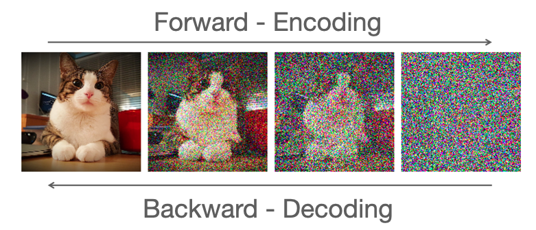
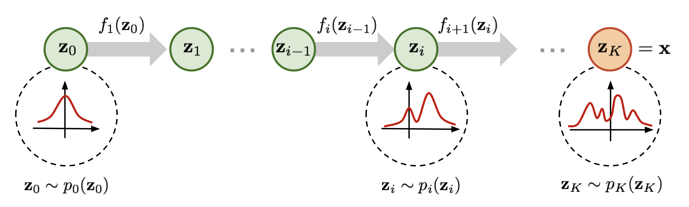
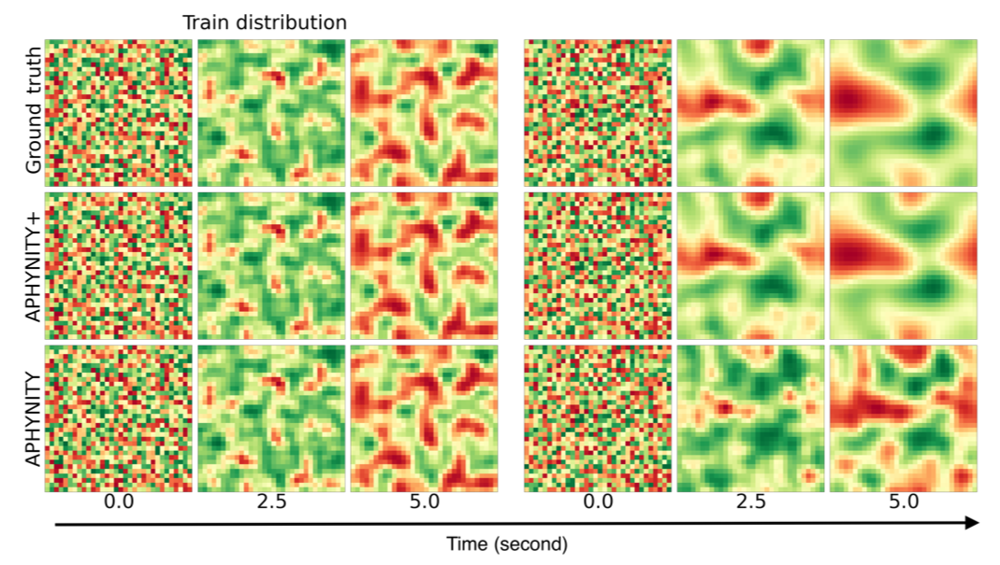

class: middle
count: True
# Inductive Bias in
#Deep Probabilistic Modelling
## Antoine Wehenkel
#### PhD Defense

.absolute.top.left.width-40[]
.absolute.top.right.width-15[]

???

Dear members of the jury, family, friends and/or colleagues. These are non-exclusive categories.
It is my pleasure and pressure to present my thesis entitled Inductive Bias in Deep Probabilistic Modelling.

---
# The Story Behind

.center.width-100[]

???
When I was younger I wanted to become neurologist,
I wanted to understand how the brain works and understand what makes us able to think.
Eventually, I gave up and found that I was more in love with maths than biology at the school.
But then, in preparing this presentation I found there was strong connections between my childhood's dreamjob and the research I did during this PhD. At a high level the goal is the same, understand how things can be intelligent and can act so in the real-world.

---
# Context
.width-100[]

???

Now for the next 55 minutes of presentation, my promise is to present some work I did during the past four years to help computer become more intelligent.

---
# *Today's menu*
 
.center[
## *Entree*
## The Why and How of Modelling
## *Plat*
##  Deep Probabilistic Modelling
## *Dessert*
##  Contributions
]

???
This presentation is organized as follows.

To this purpose, I will first  spend some time to abstract what is intelligence, how we human, make informed choice in order to achieve a goal.

- One key aspect for intelligence are models. I will explain why this is the case and how we use them.
- Then I will start to be more technical and present different Algorithmic techniques to define models thanks to deep neural networks.
- Finally I will expose some contributions I made to the development of artificial intelligence with neural networks.
---

class: section

# The Why and How of Modelling

---
# Motivation

--
count: false

.center[
<video frameborder="0" width="800"  controls>
  <source src="figures/1000USD_catch_ball.mp4" type="video/mp4"  controls>
</video>
]

???
Let us suppose someone comes to you, he throws a ball up in the air, and tells you "catch the ball I will give you 1000$".

- This could really happen to you if you walk in the street. I hope 1000$ motivates you to listen for the next hour.

- You look at the ball and then you identify the horizontal speed of the ball in order
to decide where to move to manage catching the ball.

- So internally you abstract many things, for instance you would not consider that a bird could crash into the ball
 modifies its movements. Rather you suppose the horizontal speed is constant, or maybe its very windy and you evaluate and consider its effect as well.  

---
class: black-slide

.center[<video frameborder="0" width="800" controls loop autoplay>
  <source src="figures/Newton_1.mp4" type="video/mp4"  controls loop autoplay>
</video>]
???

So basically what you do is to build a simplified representation of the movement of the ball in order to predict
about what is important, the horizontal position of the ball when it will touch the ground.

---

.important[.center[A model is a simplified representation of the reality.]]

.center.width-90[]

.footnote[Source GIF: [Newtonian Gravity: Crash Course Physics #8](https://www.youtube.com/watch?v=7gf6YpdvtE0&ab_channel=CrashCourse)]

???
*It allows us to reason, and potentially to achieve an objective.*

---

# Inference

.important[.center[Draw logical consequences from assumptions.]]

.grid[.kol-6-12[
.width-100[]
]
.kol-6-12[
.center[
<video frameborder="0" width=100%  controls>
  <source src="figures/Newton_1.mp4" type="video/mp4"  controls>
</video>
]]]

???

- A model becomes useful when we draw logical consequences.
- For instance...
- And so if we provide a model and an algorithm for inference into a computer, it can reason.

Here the assumptions are:
- The newton's law is accurate enough to describe the evolution of the system.
- The initial evolution of the ball
- The mass of the ball is constant
- The force is a simple function, maybe even a constant equal to the gravity.

In order to predict the ball position at height for which we will be able to catch it.
We must performe inference. That is we must predict the ball horizontal speed and maybe also its vertical speed
in order to chose if we have to run or just walking is fine. If we neglect the wind this means...

---

# Model Discovery

.center.circle.width-40[]

.center[
Galileo Galilei (1564 - 1642)
]

???
This shows how building mathematical model can help us automate tasks that require reasoning.
Clearly, the goal is to write down in formal terms what is happening when we solve tasks with our brain.

---
# Box's Loop

.avatars[.circle.width-100[]]

.center.width-100[]

---
# Atomic Discovery
.avatars[.circle.width-100[]]

## The first scientific atomic model: *John Dalton in 1803.*

.center.width-80[]

???
- Pose that matter is at some point discrete and that molecules are made of fixed number of fundamental atoms.
- Allows to predict how many grams of Oxygen you need to consume a certain quantity of hydrogen and create water for instance.Ò

--

.center.width-80[]

???
- Does not explain why some atoms react together and others not.
- Fails to explain that atoms seems made of positive and negative charges that are observed when we bend

---
# Atomic Discovery
.avatars[.circle.width-100[]]

## Electrons and protons: *JJ Thomson in 1897.*

.grid[
.kol-4-12[.center.width-90[]
]]

???
Fail to predict Ernest Rutherford experiments with a gold foil.

---
count: false

# Atomic Discovery
.avatars[.circle.width-100[]]

## Electrons and protons: *JJ Thomson in 1897.*

.grid[
.kol-4-12[
.center.width-90[]

.center.width-70[]
]
.kol-8-12[.center.width-100[]
]
]

???
1897
plum pudding model
---
# Atomic Discovery
.avatars[.circle.width-100[]]

## The nucleus: *Ernest Rutherford in 1911.*
.grid[
.kol-4-12[.center.width-90[]
]]
???
1911
---
count: false

# Atomic Discovery
.avatars[.circle.width-100[]]

## The nucleus: *Ernest Rutherford in 1911.*
.grid[
.kol-4-12[.center.width-90[]
].kol-8-12[.center.width-90[]
]]
???
1911

---
# Atomic Discovery
.avatars[.circle.width-100[]]

## Discrete energy levels: *Niels Bohr in 1913.*

.grid[
.kol-4-12[.center.width-90[]
]]

--
.avatars[.circle.width-100[] .circle.width-100[]]

## Uncertainty on the electrons positions and speeds: *Erwin Schrödinger in 1926.*

???
Quantization of atoms.
allows to predict the properties of the atoms. It explains the Mendeleiv table.
1915

---
# Box's Loop in Science
.center.grid[
.kol-2-12[.circle.stretch[]]
.kol-2-12[.circle.stretch[]]
.kol-2-12[.circle.stretch[]]
.kol-2-12[.circle.stretch[]]
.kol-2-12[.circle.stretch[]]
.kol-2-12[.circle.stretch[]]
]

.center.width-90[]

---
# Box's Loop in Science
.center.grid[
.kol-2-12[.circle.stretch[]]
.kol-2-12[.circle.stretch[]]
.kol-2-12[.circle.stretch[]]
.kol-2-12[.circle.stretch[]]
.kol-2-12[.circle.stretch[]]
.kol-2-12[.circle.stretch[]]
]

.center.width-90[]

---
# Machine Learning
## A model for translation:
## *Describe formally the relationship between languages.*

.center.width-80[]

???

- What if we do not have a good understand of the system studied?
- If we cannot rely on years of research and smart people finding elegant way to describe it?
- This is where machine learning can help.

- We also have a model but it is not as constrained as the one we would use in science
- We rather have many parameters

---
count: false

# Machine Learning
## A model for translation:
## *Describe formally the relationship between languages.*

.center.width-80[]

???

- What if we do not have a good understand of the system studied?
- If we cannot rely on years of research and smart people finding elegant way to describe it?
- This is where machine learning can help.

- We also have a model but it is not as constrained as the one we would use in science
- We rather have many parameters
---

count: false

.grid[
.kol-9-12[## *Parametric model*: $f\_\theta: \mathcal{X} \rightarrow \mathcal{Y}.$
.important[Use large amount of data to infer the parameters of a very expressive model.]
].kol-3-12[.center.width-100[]]
]
--
count:false

*Learning*: $\theta^\star = \arg\min\_\theta \mathbb{E}\_{\mathcal{D}} \left[ d(f\_\theta, x, y) \right].$

.center.width-60[]

--
count: false

.important[Learning = Model Selection = Inference = Model Discovery]

???

- What if we do not have a good understand of the system studied?
- If we cannot rely on years of research and smart people finding elegant way to describe it?
- This is where machine learning can help.

- We also have a model but it is not as constrained as the one we would use in science
- We rather have many parameters

---
# The curse of dimensionality

.center.width-100[.grid[
.kol-4-12[
.center.width-100[]
.center.width-100[]
]
.kol-4-12[
.center.width-100[]
.center.width-100[]
]
.kol-4-12[
.center.width-100[]
.center.width-10[]
]
]]
???

The curse of dimensionality, the necessity of defining a meanigful class of Models
It is impossible to learn if we do not make some assumptions.
For some problems we cannot accumulate a lot of data.

---
class: section

# Deep Probabilistic Modelling

---
# Deep Probabilistic Modelling
## Neural Networks

.center.width-100[]

---
count: false

# Deep Probabilistic Modelling
## Neural Networks
.center.width-100[]

---
count: false

# Deep Probabilistic Modelling
## Neural Networks
.center.width-100[]

---
count: false

# Deep Probabilistic Modelling
## Neural Networks
.center.width-100[]

---
count: false

# Deep Probabilistic Modelling
## Neural Networks
.center.width-100[]

---
class: black-slide
# Probabilistic Modelling
.important[Model randomness or uncertainty with the language of probability.]

<video frameborder="0" width=90%  controls>
  <source src="figures/Newton_2.mp4" type="video/mp4"  controls>
</video>

???
Effective framework to create and analyze models in front of data.
Combined with algorithms it allows computers to analyze data in front of models
in a flexible way. In the end both scientific models and machine learning
models try to achieve the same goal... Create an abstract representation of a real-world phenomenon
with mathematical terms such that we can confront it to data and make prediction with it

---
count: false

# Bayesian Networks

- Probabilistic graphical models formally introduced by Judea Pearl in the 80's
- A Bayesian network is a directed acyclic graph that factorizes the model distribution as $$p(\mathbf{x}) = \prod_{i=1}^D p(x\_i|\mathcal{P}\_i).$$
- e.g when $d=4$:
.grid[.kol-8-12[$p(\mathbf{x}) = p(x\_1) p(x\_2|x\_1) p(x\_3|x\_2)p(x\_4|x\_1, x\_2, x\_3)$]
.kol-4-12[.width-100[]]]

???
On the opposite one class of models that have been popular to model the joint probability distribution of tabular data are Bayesian networks. These are Probabilistic graphical models formally introduced by Pearl in the 80's. These models vizually depicts through a directed acyclic graph the factorization of the distribution modeled. And we can read the graph to check whether or not some independencies are hypothesized by the model. For example with a vector of dimension 4, we could assume the following bayesian net, that would be equivalent to assume that the joint distribution of p(x) is given by the following factorization. And then we can use the BN and an algorithm that is called d-separatation to see that this factorization implies that x1 is independent from x3 given x2 and x4.

One way of representing these models is with a graphical structure that denotes
independence assumptions we suppose reasonable.

---
# Deep Probabilistic Models

.important[Parameterize a probabilistic model with neural networks.]
## Implicit models

.width-70.center[]

$\theta^\star = \arg\min\_\theta \mathbb{E}\_{\mathcal{D}} \left[ d(f\_\theta, x) \right].$

--
count: false

$d$ compares $p\_{\mathcal{D}}(x)$ and $p\_{\theta}(x)$, e.g. Kulback-Leibler divergence.

???
But how do we train them?

---
count: false
# Deep Probabilistic Models

.important[Parameterize a probabilistic model with neural networks.]
## Explicit models

.width-50.center[]

$\theta^\star = \arg\min\_\theta \mathbb{E}\_{\mathcal{D}} \left[ d(f\_\theta, x) \right].$

$d$ compares $p\_{\mathcal{D}}(x)$ and $p\_{\theta}(x)$, e.g. Kulback-Leibler divergence.

---

# Variational auto-encoder
.center.width-100[]

--
count: false

## Objective:
$$
\begin{aligned}
\theta^\star &= \arg\min\_\theta \mathbb{E}\_{\mathcal{D}} \left[ d(f\_\theta, x) \right]
=  \arg\min\_\theta  \mathbb{E}\_{x\sim p\_\mathcal{D}}\left[ \log \frac{\log p\_\mathcal{D}(x) }{p\_\theta(x)} \right]\\\\
&=
\arg\max\_\{\theta} \sum\_{x \in \mathcal{D}} \\log p\_\\theta(x).
\end{aligned}
$$
???
Raccrocher à l'example
---
count: false

# Variational auto-encoder

.center.width-100[]

--
count: false

## Objective:
$$
\begin{aligned}
\max\_\{\theta, \\psi\} \\log p\_\\theta(x)=&\max\_\{\theta, \\psi\}\log \mathbb{E}\_{p\_\psi(z|x)}\left[ \frac{p\_\theta(x | z) p(z)}{p\_\psi(z|x)} \right]\\\\
\geq &\max\_\{\theta, \\psi\}\mathbb{E}\_{p\_\psi(z|x)}\left[ \log \frac{p\_\theta(x | z) p(z)}{p\_\psi(z|x)} \right]
\end{aligned}
$$

???
Raccrocher à l'example
---
# Diffusion Models

.center.width-80[]
---
count: false
# Diffusion Models

.center.width-80[]
.center.width-60[]

---
# Normalizing Flows

.important[A normalizing flow is a *bijective function* used to model a *probability distribution* via a *change of variables*.]

.center[.width-100[]]

.center[$ p(\mathbf{x}; \mathbf{\theta}) = p\_\mathbf{z}(f(\mathbf{x}; \mathbf{\theta})) \left| \det J\_f(\mathbf{x}; \mathbf{\theta})\right|, \quad f(.;  \mathbf{\theta}): \mathbb{R}^d \rightarrow \mathbb{R}^d$ a neural network.]

.footnote[https://lilianweng.github.io/lil-log/2018/10/13/flow-based-deep-generative-models.html]

???
Raccrocher à l'example

---
.grid[

.kol-4-12[
### Normalizing Flows
.center.width-100[]

]
.kol-4-12[
### Diffusion Models
.center.width-100[]

]
.kol-4-12[
### VAEs
.center.width-100[]
]

]
.grid[

.kol-4-12[
- Explicit
- .green[Training]
- .red[Architecture]
]
.kol-4-12[
- Implicit
- .green[Architecture & Training]
- .red[Sample]

]
.kol-4-12[
- Implicit
- .green[Architecture & Sample]
- .red[Training]
]

]

---
class: section

# Contributions

---
# Graphical Normalizing Flows
## How to define a bijective function with a neural network $f$?

--
## $f(\mathbf{x}) = \begin{bmatrix} f_1(x\_1; \mathbf{c}_i(\mathbf{x})) & ... & f_d(x\_d; \mathbf{c}_d(\mathbf{x})) \end{bmatrix}^T.$
--
count: false
## *Sufficient condition:* $\left| \det J_f(\mathbf{x}; \mathbf{\theta})\right| > 0 \quad \forall \mathbf{x} \in \mathbb{R}^d.$
--

## *Note*: $\det J_f(\mathbf{x}) = J_f(P(\mathbf{x}))$ for any permutation $P$.

--
## *Idea:* Make $J_f$ triangular (up to a certain permutation $P$) $\Rightarrow \det J\_f = \prod^d\_1 \frac{d f\_i}{d x\_i}.$

--
## $\frac{d f\_i}{d x\_i} > 0 \Rightarrow \det J_f(\mathbf{x}) > 0.$

---
# Graphical Normalizing Flows
## *What is $f$?* $f(\mathbf{x}) = \begin{bmatrix} f_1(x\_1; \mathbf{c}_i(\mathbf{x})) & ... & f_d(x\_d; \mathbf{c}_d(\mathbf{x})) \end{bmatrix}^T.$
## $f$ can be an autoregressive function.
.grid[
.kol-4-12[.width-70[]]
.kol-8-12[
$z_i = f\_i(x_i; \mathbf{c}\_i(\mathbf{x})).$

The autoregressive conditioner is $\mathbf{c}\_i(\mathbf{x}) = \mathbf{h}\_i\left(\begin{bmatrix} x\_1 & ... & x\_{i-1} \end{bmatrix}^T\right).$

]
]
---
# Graphical Normalizing Flows
## *What is $f$?* $f(\mathbf{x}) = \begin{bmatrix} f_1(x\_1; \mathbf{c}_i(\mathbf{x})) & ... & f_d(x\_d; \mathbf{c}_d(\mathbf{x})) \end{bmatrix}^T.$
## $f$ can be a bipartite function.
.grid[
.kol-4-12[.width-70[]]
.kol-8-12[
$z_i = f\_i(x_i; \mathbf{c}\_i(\mathbf{x})).$

The coupling conditioner is $\mathbf{c}\_i(\mathbf{x}) =$
- $\underline{\mathbf{h}}\_i \quad \text{if} \quad i \leq d$ (a constant);
- $\mathbf{h}\_i\left(\begin{bmatrix} x\_1 & ... & x\_d \end{bmatrix}^T\right)$ if $i > d$.

]
]
---
# Graphical Normalizing Flows
## *What is $f$?* $f(\mathbf{x}) = \begin{bmatrix} f_1(x\_1; \mathbf{c}_i(\mathbf{x})) & ... & f_d(x\_d; \mathbf{c}_d(\mathbf{x})) \end{bmatrix}^T.$
## $f$ can be any function defined by a Directed Acyclic Graph.
.grid[
.kol-4-12[.width-70[]]
.kol-8-12[
$z_i = f\_i(x_i; \mathbf{c}\_i(\mathbf{x})).$

The graphical conditioner is $\mathbf{c}\_i(\mathbf{x}) = \mathbf{h}\_i(\mathbf{x} \odot A_{i,:})$,
where $A \in $ {$0, 1$}$^D$ is the corresponding adjacency matrix.

]
]

???

In these two contributions we make connections between some normalizing flows and Bayesian networks.
This allows us to embed into

---

# Learning the Topology

## Maximize the model's likelihood:
###  $ \max\_{A\in\mathbb{R}^{d\times d}} F(A) $  s.t. $ \mathcal{G}(A) \in \mathsf{DAGs}$.

--
count:false
## As a continuous constraint:

### $ \max\_{A\in\mathbb{R}^{d\times d}} F(A)$  s.t. $w(A) = 0$ where $w(A) := \text{Trace}\left(\sum^D\_{i=1} A^i\right)$.

---
count:false

# Learning the Topology

## Maximize the model's likelihood:
###  $ \max\_{A\in\mathbb{R}^{d\times d}} F(A) $  s.t. $ \mathcal{G}(A) \in \mathsf{DAGs}$.
## As a continuous constraint:

### $ \max\_{A\in\mathbb{R}^{d\times d}} F(A)$  s.t. $w(A) = 0$ where $w(A) := \text{Trace}\left(\sum^D\_{i=1} A^i\right)$.

.grid[.kol-3-12[.width-100[]] .kol-3-12[] .kol-3-12[] .kol-3-12[]  ]
---
count:false

# Learning the Topology

## Maximize the model's likelihood:
###  $ \max\_{A\in\mathbb{R}^{d\times d}} F(A) $  s.t. $ \mathcal{G}(A) \in \mathsf{DAGs}$.
## As a continuous constraint:

### $ \max\_{A\in\mathbb{R}^{d\times d}} F(A)$  s.t. $w(A) = 0$ where $w(A) := \text{Trace}\left(\sum^D\_{i=1} A^i\right)$.

.grid[.kol-3-12[.width-100[]] .kol-3-12[.width-100[]] .kol-3-12[] .kol-3-12[]  ]
---
count:false

# Learning the Topology

## Maximize the model's likelihood:
###  $ \max\_{A\in\mathbb{R}^{d\times d}} F(A) $  s.t. $ \mathcal{G}(A) \in \mathsf{DAGs}$.
## As a continuous constraint:

### $ \max\_{A\in\mathbb{R}^{d\times d}} F(A)$  s.t. $w(A) = 0$ where $w(A) := \text{Trace}\left(\sum^D\_{i=1} A^i\right)$.

.grid[.kol-3-12[.width-100[]] .kol-3-12[.width-100[]] .kol-3-12[.width-100[]] .kol-3-12[]  ]
---
count:false
# Learning the Topology

## Maximize the model's likelihood:
###  $ \max\_{A\in\mathbb{R}^{d\times d}} F(A) $  s.t. $ \mathcal{G}(A) \in \mathsf{DAGs}$.
## As a continuous constraint:

### $ \max\_{A\in\mathbb{R}^{d\times d}} F(A)$  s.t. $w(A) = 0$ where $w(A) := \text{Trace}\left(\sum^D\_{i=1} A^i\right)$.

.grid[.kol-3-12[.width-100[]] .kol-3-12[.width-100[]] .kol-3-12[.width-100[]] .kol-3-12[.width-100[]]  ]

---
class: black-slide
# Affine Transformations
.center[ $z_i = f\_i(x_i; \mathbf{c}\_i(\mathbf{x}))$]
.center[<video frameborder="0" width=100% controls loop autoplay>
  <source src="figures/AffineNF.mp4" type="video/mp4"  controls loop autoplay>
</video>]
---
class: black-slide

# Monotonic Transformations

.center[ $z_i = f\_i(x_i; \mathbf{c}\_i(\mathbf{x}))$]
.center[<video frameborder="0" width=100% controls loop autoplay>
  <source src="figures/MonotonicTransformation.mp4" type="video/mp4"  controls loop autoplay>
</video>]

---
class: black-slide

# Monotonic Neural Networks
.center[<video frameborder="0" width=100% controls loop autoplay>
  <source src="figures/UMNN.mp4" type="video/mp4"  controls loop autoplay>
</video>]
---
# Normalizing Flows

## Contributions:
- Unify coupling and autoregressive conditioners.
--
count: false

- Generalize continuous Bayesian networks.
--
count: false

- Inductive bias in normalizing flows.

--
count: false

- Analyze the expressivity of affine flows.

--
count: false

- Introduce unconstrained monotonic neural networks.

---

.center.width-100[]

## Objective:
$$
\begin{aligned}
\max\_\{\theta, \\psi\} \frac{1}{N}\sum\_{i=1}^N \left[\mathbb{E}\_{p\_\psi(z|x\_i)}\left[ \log \frac{p\_\theta(x\_i | z) p(z)}{p\_\psi(z|x\_i)} \right] \right]
\end{aligned}
$$
--
count: false
Let $q\_\psi(z) := \frac{1}{N} \sum\_{i=1}^N p\_\psi(z|x\_i) \quad \Rightarrow
\quad \min\_\{\\psi\} \int q\_\psi(z) \log p(z) dz.
$
---
count: false

.grid[
.kol-4-12[.width-100[]]
.kol-4-12[]
.kol-4-12[]
]

Let $q\_\psi(z) := \frac{1}{N} \sum\_{i=1}^N p\_\psi(z|x\_i) \quad \Rightarrow
\quad \min\_\{\\psi\} \int q\_\psi(z) \log p(z) dz.
$

.footnote[Credits: Jakub Tomzcak - [https://jmtomczak.github.io/blog/7/7_priors.html](https://jmtomczak.github.io/blog/7/7_priors.html)]

---
count: false

.grid[
.kol-4-12[.width-100[]]
.kol-4-12[.width-100[]]
.kol-4-12[]
]

Let $q\_\psi(z) := \frac{1}{N} \sum\_{i=1}^N p\_\psi(z|x\_i) \quad \Rightarrow
\quad \min\_\{\\psi\} \int q\_\psi(z) \log p(z) dz.
$

.footnote[Credits: Jakub Tomzcak - [https://jmtomczak.github.io/blog/7/7_priors.html](https://jmtomczak.github.io/blog/7/7_priors.html)]
---
count: false

.grid[
.kol-4-12[.width-100[]]
.kol-4-12[.width-100[]]
.kol-4-12[.width-100[]]
.kol-4-12[]
]

Let $q\_\psi(z) := \frac{1}{N} \sum\_{i=1}^N p\_\psi(z|x\_i) \quad \Rightarrow
\quad \min\_\{\\psi\} \int q\_\psi(z) \log p(z) dz.
$

.footnote[Credits: Jakub Tomzcak - [https://jmtomczak.github.io/blog/7/7_priors.html](https://jmtomczak.github.io/blog/7/7_priors.html)]

--
.important[Contribution: Model the prior with a diffusion model.]

$$
\begin{aligned}
\mathbb{E}\_{p\_\psi(z|x\_i)}\left[ \log \frac{p\_\theta(x\_i | z) p(z)}{p\_\psi(z|x\_i)} \right]  \Rightarrow
\mathbb{E}\_{p\_\psi(z|x\_i)}\left[ \log \frac{p\_\theta(x\_i | z)}{p\_\psi(z|x\_i)} \right]+ \mathbb{E}\_{p\_\psi(z|x\_i)}\left[ \log p\_\phi(z) \right]
\end{aligned}
$$
---
.center[.width-60[]

.quote[If I have seen further, it is by standing on the shoulders of giants.]

.pull-right[Isaac Newton.]
]

---

.center.width-60[]
???
Hybrid learning tries to combine the type of models in one paradigm.

---

# Hybrid Learning
.center.width-100[]
---

# Hybrid Learning
.center.width-100[]
---

# Contribution
.center.width-60[]

---
# Robust Hybrid Learning
.center.width-80[]
.center[
$\\frac{dy\_t}{dt} = F\_e(y\_t; z\_e) + F\_a(y\_t; z\_a)$  
 $F\_e := \\begin{bmatrix}a \\Delta u\_t b \\Delta v\_t \\end{bmatrix}^T$ and
 $F\_a := \\begin{bmatrix}R\_u(u\_t, v\_t;k) \\\\ R\_v(u\_t, v\_t)\\end{bmatrix}^T$
]
.footnote[Robust Hybrid Learning With Expert Augmentation; Wehenkel et al.]

---
.center.circle.width-40[]

.quote[With four parameters I can fit an elephant, and with five I can make him wiggle his trunk.]

.pull-right[John Von Neumann.]
