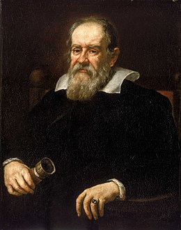
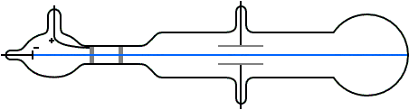
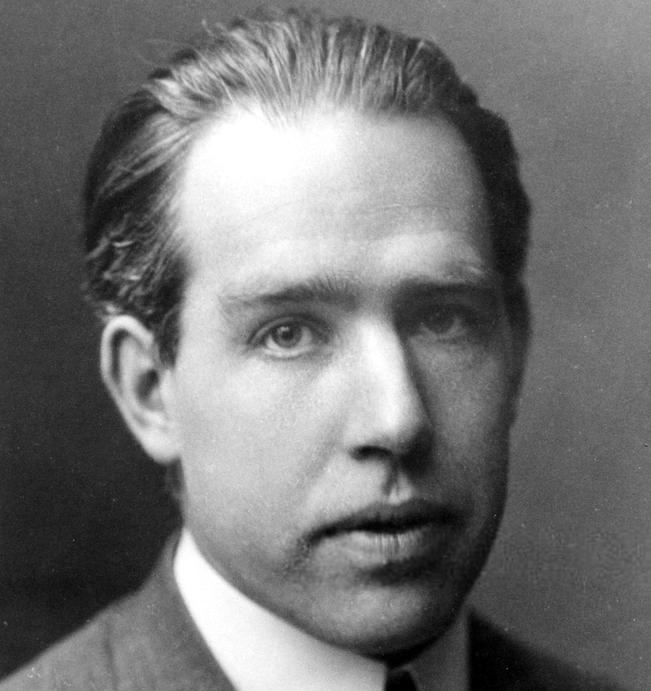
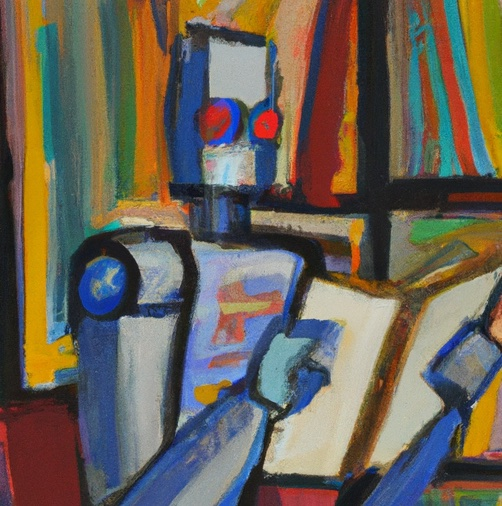
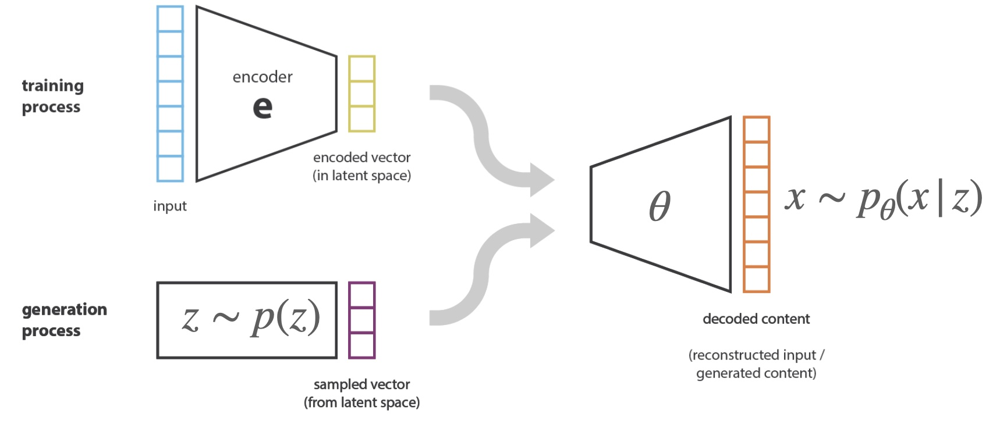
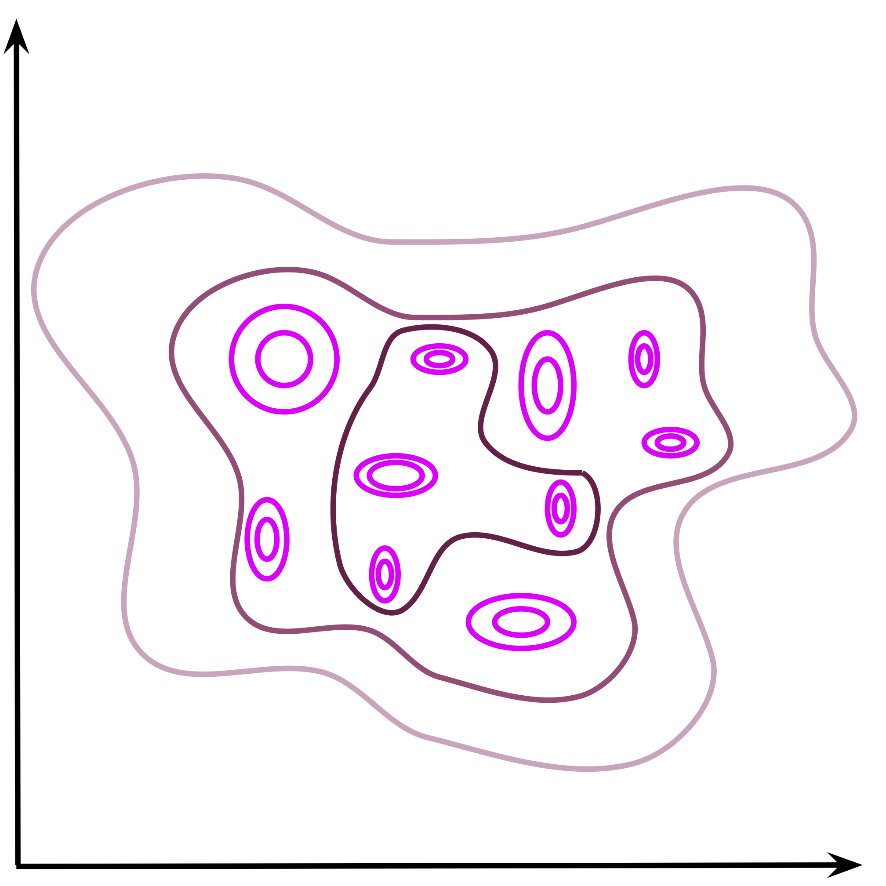
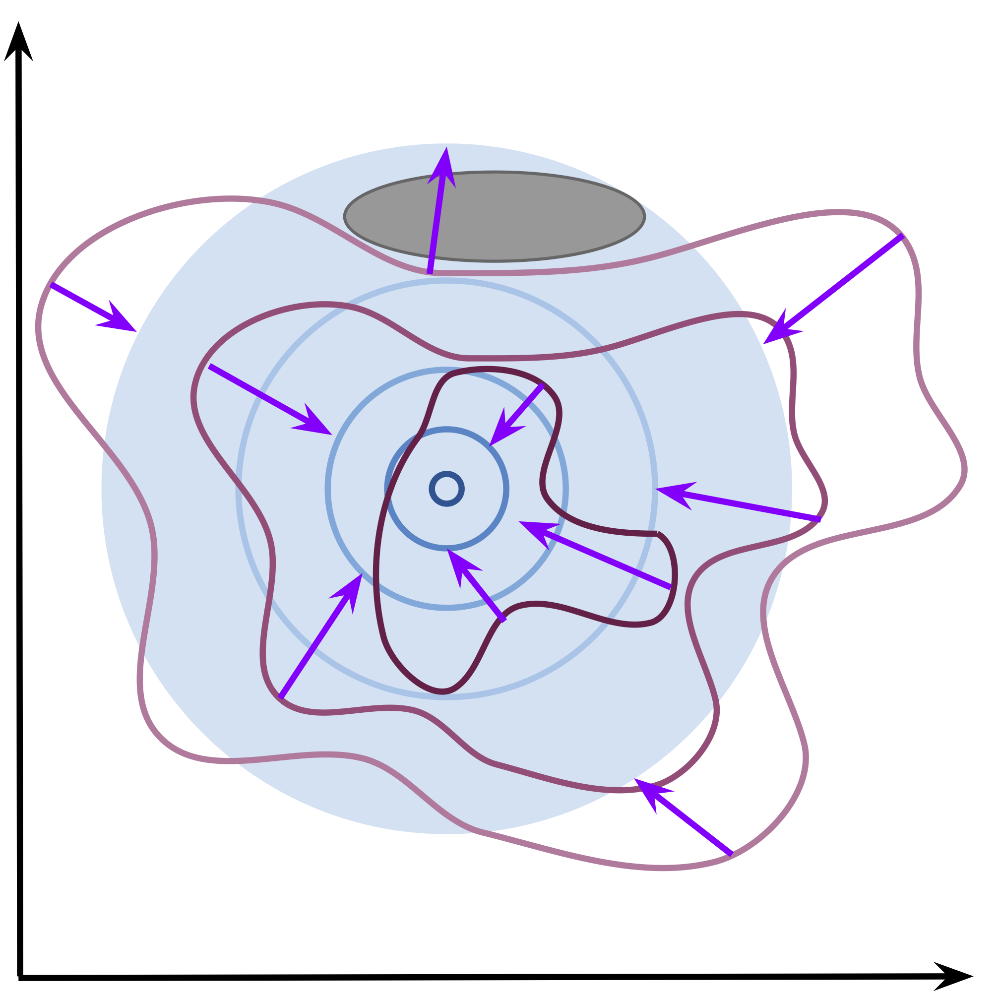
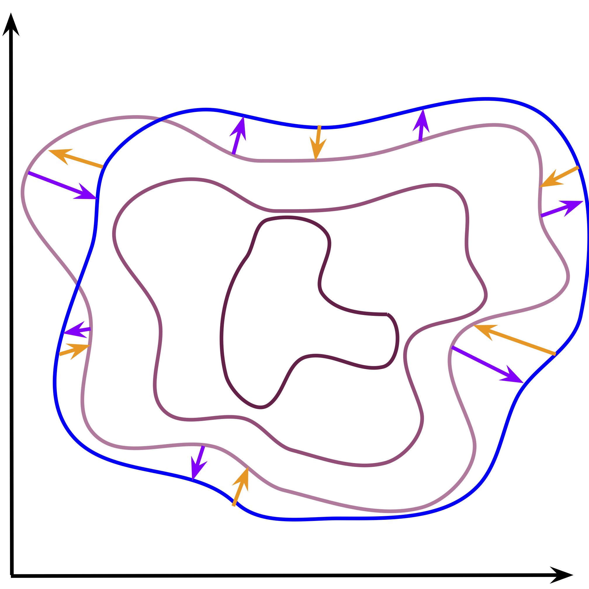

class: middle
count: True
# Inductive Bias in
#Deep Probabilistic Modelling
## Antoine Wehenkel
#### PhD Defense

.absolute.top.left.width-40[]
.absolute.top.right.width-15[]

???

Dear members of the jury, dear colleagues, dear family, dear friends!

Let me start my presentation with a small riddle!
This is what allows you to make informed decisions in order
to maximize the chance of achieving an objective. For instance, this is what
helped you to find your way to this room and achieve the awesome objective of spending the next hour with me.
I am not talking about your brain, but rather about the concept of intelligence.

In the last years, I have tried to build or improve algorithms that make machines intelligent.
That is making machines able to make informed choice. This is what we call artificial intelligence.
To make machine intelligent, there are two strategies, we can directly encode the intelligent reasoning in the machine.
Or, instead, we can let machines learn from data.
In my thesis, I have focused on the second strategy, that's what we call machine learning.
And in particular, behind this scary title hide contributions

I made to help machine learn good abstraction of the world.

---
# Motivation

--
count: false

.center[
<video muted  frameborder="0" width="800" autoplay controls>
  <source src="figures/1000USD_catch_ball.mp4" type="video/mp4"  controls>
</video>
]

???

Why is building an abstraction of the world important you might ask?
I have a motivation, 1000$

---
class: black-slide

.center[## Inference: draw logical consequences from assumptions.]

.center[
<video muted frameborder="0" width="800" autoplay controls>
  <source src="figures/Newton_1.mp4" type="video/mp4" controls>
</video>
]
???

So basically what you do is to build a simplified representation of the movement of the ball in order to predict
about what is important, the horizontal position of the ball when it will touch the ground.

---

.important[.center[A model is a simplified representation of the reality.]]

.center.width-90[]

.footnote[Source GIF: [Newtonian Gravity: Crash Course Physics #8](https://www.youtube.com/watch?v=7gf6YpdvtE0&ab_channel=CrashCourse)]

???
*It allows us to reason, and potentially to achieve an objective.*
- Pas parler de Newton
- Model est ce qui reprend ces hypothèses
- On se concentre sur des modele qu’on sait exprimer formellement

---

# Model Discovery

.center.circle.width-40[]

.center[
Galileo Galilei (1564 - 1642)
]

???
This shows how building mathematical model can help us automate tasks that require reasoning.
Clearly, the goal is to write down in formal terms what is happening when we solve tasks with our brain.

---
# Atomic Discovery
.avatars[.circle.width-100[]]

## The first scientific atomic model: *John Dalton in 1803.*

.center.width-80[]

???
- Pose that matter is at some point discrete and that molecules are made of fixed number of fundamental atoms.
- Allows to predict how many grams of Oxygen you need to consume a certain quantity of hydrogen and create water for instance.Ò

???
- Does not explain why some atoms react together and others not.
- Fails to explain that atoms seems made of positive and negative charges that are observed when we bend

---
# Atomic Discovery
.avatars[.circle.width-100[]]

## Electrons and protons: *JJ Thomson in 1897.*

.center.width-80[]

.center.width-40[]

???
plum pudding model
---
# Atomic Discovery
.avatars[.circle.width-100[]]

## The nucleus: *Ernest Rutherford in 1911.*
.center.width-70[]

???
1911

---
# Atomic Discovery
.avatars[.circle.width-100[]]

## Discrete energy levels: *Niels Bohr in 1913.*

.center.width-40[]

.center.width-90[]

--
.avatars[ .circle.width-100[]]

## Uncertainty on the electrons positions and speeds: *Erwin Schrödinger in 1926.*

???
Quantization of atoms.
allows to predict the properties of the atoms. It explains the Mendeleiv table.
1915

---
class: vertical-align-slide

# Box's Loop

.avatars[.circle.width-100[]]

.center.width-100[]

---

.avatars[.circle.width-100[]]

 

 
.center.width-100[]
---
count: false

.avatars[.circle.width-100[]]

 

 
.center.width-100[]
---
count: false

.avatars[.circle.width-100[]]

 

 
.center.width-100[]

---
count: false

.avatars[.circle.width-100[]]

 

 
.center.width-100[]

---
count: false

.avatars[.circle.width-100[]]

 

 
.center.width-100[]

---
# Who's next?

--
.avatars[.center.circle.width-100[]]

--
.vertical-center.center.width-80[]

---
class: section

# Accelerate model discovery

---
# Contributions

- Unconstrained Monotonic Neural Networks, 2019
- *You say Normalizing Flows I see Bayesian Networks, 2020*
- Graphical normalizing flows, 2021
- *Diffusion priors in variational autoencoders, 2021*
- Robust Hybrid Learning With Expert Augmentation, 2022

--
 
 
 
 
.important.center[Improvements to deep probabilistic models.]

---
class: black-slide
# Probabilistic Modelling
.important[Model randomness or uncertainty with the language of probability.]

<video muted frameborder="0" width=90%  autoplay controls loop>
  <source src="figures/Newton_2.mp4" type="video/mp4"  controls>
</video>

???
Effective framework to create and analyze models in front of data.
Combined with algorithms it allows computers to analyze data in front of models
in a flexible way. In the end both scientific models and machine learning
models try to achieve the same goal... Create an abstract representation of a real-world phenomenon
with mathematical terms such that we can confront it to data and make prediction with it

---
# Deep Neural Networks

.center.width-70[]

---
count: false

# Deep Neural Networks

.center.width-70[]

--
count: false

- $f\_\theta: \mathcal{X} \rightarrow \mathcal{Y},$
- Solve $\theta^\star = \arg\min\_{\theta} \mathbb{E}\_{x, y}\left[ d(f\_\theta, x, y) \right]$ via gradient descent.

---

# Discrete Output

.center.width-80[]
 
## $$\theta^\star = \arg\min\_{\theta} \mathbb{E}\_{x, y}\left[ d(f\_\theta, x, y) \right].$$

---

# Discrete Output

.center.width-80[]
Let $d := KL = 0 \iff P\_\theta(y|x) == P(y | x)$, then
$$
\begin{aligned}
\theta^\star &= \arg\min\_{\theta} \mathbb{E}\_{x} \left[ KL(P(y | x)) || P\_\theta(y|x) \right]  = \arg\min\_{\theta} \mathbb{E}\_{x}\mathbb{E}\_{y|x}\left[ \log \frac{P(y | x)}{P\_\theta(y|x)}\right]\\\\
&= \arg\min\_{\theta} \mathbb{E}\_{x, y}\left[ -\log P\_\theta(y|x)\right] + \underbrace{\mathbb{E}\_{x, y}\left[ -\log P(y|x)\right]}\_{C} \\\\
&= \arg\max\_{\theta} \mathbb{E}\_{x, y}\left[ \log P\_\theta(y|x)\right].
\end{aligned}
$$

---
# Continuous Output

.center.width-80[]

## $$p\_\theta(y|x) := \frac{1}{\sqrt{2 \pi \sigma\_\theta(x)^2}} \exp{-\frac{(y - \mu\_\theta(x))^2}{2\sigma\_\theta(x)^2}}.$$

---
class: black-slide
# Affine Transformations
.center[<video muted frameborder="0" width=100% controls autoplay>
  <source src="figures/AffineNF.mp4" type="video/mp4"  controls loop autoplay>
</video>]
---
class: black-slide

# Monotonic Transformations

.center[<video muted frameborder="0" width=100% controls autoplay>
  <source src="figures/MonotonicTransformation.mp4" type="video/mp4"  controls loop autoplay>
</video>]

---
class: black-slide

# Monotonic Neural Networks
.center[<video muted frameborder="0" width=100% controls autoplay>
  <source src="figures/UMNN.mp4" type="video/mp4"  controls loop autoplay>
</video>]

---
class: section

.center[# What if .white[$x$] is multi-dimensional?]

---
# Bayes' rule

 
 
 
 
 
# .center[$p(y\_1, y\_2) = p(y\_1) p(y\_2|y\_1)$]
---
count: false
# Bayes' rule

 
 
 
 
 
# .center[$p(y\_1, y\_2) = p(y\_1) p(y\_2)$]

---

# Bayesian Networks
 

.grid[.kol-6-12[

.center.width-80[]
]
.kol-6-12[
.center.width-80[]
]
]

--
count: false
## .center[$p(\mathbf{y}) = p(y\_1) p(y\_3) p(y\_2|y\_3)p(y\_4|y\_1, y\_4).$]

--
count: false

## *What is $f$?*
## $$f(\mathbf{y}) = \begin{bmatrix} f\_1(y\_1) & f\_2(y\_2; y\_3) & f\_3(y\_3) & f_4(y\_4; y\_1, y\_2) \end{bmatrix}^T.$$

???
On the opposite one class of models that have been popular to model the joint probability distribution of tabular data are Bayesian networks. These are Probabilistic graphical models formally introduced by Pearl in the 80's. These models vizually depicts through a directed acyclic graph the factorization of the distribution modeled. And we can read the graph to check whether or not some independencies are hypothesized by the model. For example with a vector of dimension 4, we could assume the following bayesian net, that would be equivalent to assume that the joint distribution of p(x) is given by the following factorization. And then we can use the BN and an algorithm that is called d-separatation to see that this factorization implies that x1 is independent from x3 given x2 and x4.

One way of representing these models is with a graphical structure that denotes
independence assumptions we suppose reasonable.

---
# Autoregessive Normalizing Flows

 
 
 
.grid[
.kol-6-12[.width-70[]]
.kol-6-12[
 
## $z_i = f\_i(y_i; \mathbf{c}\_i(\mathbf{y})).$

## $\mathbf{c}\_i(\mathbf{y}) = \mathbf{h}\_i\left(\begin{bmatrix} y\_1 & ... & y\_{i-1} \end{bmatrix}^T\right).$

]
]
---
# Coupling Normalizing Flows

 
 
 
.grid[
.kol-6-12[.width-70[]]
.kol-6-12[
## $z_i = f\_i(y_i; \mathbf{c}\_i(\mathbf{y})).$

## $\mathbf{c}\_i(\mathbf{y}) =$
- ## $\underline{\mathbf{h}}\_i \quad \text{if} \quad i \leq d$;
- ## $\mathbf{h}\_i\left(\begin{bmatrix} y\_i & ... & y\_d \end{bmatrix}^T\right)$ if $i > d$.
]
]

---
# Graphical Normalizing Flows

 
 
.grid[
.kol-4-12[.width-100[]]
.kol-4-12[.width-80[]]
.kol-4-12[
 
## $z\_i = f\_i(y\_i; \mathbf{c}\_i(\mathbf{y})).$

## $\mathbf{c}\_i(\mathbf{y}) = \mathbf{h}\_i(\mathbf{y} \odot A\_{:, i}).$
]
]

--

 
## $$p\_{\mathbf{f}}(\mathbf{y})  =  \prod\_{i=1}^d p(z\_i = f\_i(y\_i; \mathbf{c}\_i(\mathbf{y}))) |\frac{\partial f\_i}{\partial y\_i}|.$$

???

In these two contributions we make connections between some normalizing flows and Bayesian networks.
This allows us to embed into
---
class: black-slide

# Another perspective
## $$ p(\mathbf{y}; \mathbf{\theta}) = p\_\mathbf{z}(f(\mathbf{y}; \mathbf{\theta})) \left| \det J\_f(\mathbf{y}; \mathbf{\theta})\right|.$$

.center[
<video muted frameborder="0" width="600"  autoplay controls>
  <source src="figures/determinant.mp4" type="video/mp4"  controls>
</video>
]

---
count: false
# Another perspective

## $$ p(\mathbf{y}; \mathbf{\theta}) = p\_\mathbf{z}(f(\mathbf{y}; \mathbf{\theta})) \left| \det J\_f(\mathbf{y}; \mathbf{\theta})\right|.$$

## *Ancestral ordering of DAGs.*

--
## $J_f$ is triangular (up to a certain permutation $P$) $\Rightarrow \det J\_f = \prod^d\_1 \frac{d f\_i}{d y\_i}.$

--
## $\frac{d f\_i}{d y\_i} > 0 \Rightarrow \det J_f(\mathbf{y}) > 0.$

## *Sufficient condition:* $ \det J_f(\mathbf{y}; \mathbf{\theta}) > 0 \quad \forall \mathbf{y} \in \mathbb{R}^d.$

---

# Learning the Topology

--
count:false
 
 
##  $$ \max\_{A} F(A), $$
##  subject to,
## .center[$A \in\{0, 1\}^{d\times d}$ and  $\mathcal{G}(A) \in \mathsf{DAGs}.$]

.grid[.kol-6-12[.width-100[]] .kol-6-12[.width-70[]]]

---
count:false

# Learning the Topology

 
 
##  $$ \max\_{A} F(A), $$
##  subject to,
## .center[$A \in \mathbb{R}^{d\times d}$ and $\text{Trace}\left(A^i\right) = 0 \quad \forall i .$]

.grid[.kol-6-12[.width-100[]] .kol-6-12[.width-80[]]]

---
count:false

# Learning the Topology

 
 
##  $$ \max\_{A} F(A), $$
##  subject to,
## .center[$A \in \mathbb{R}^{d\times d}$ and $\text{Trace}\left(A^i\right) = 0 \quad \forall i .$]

.grid[.kol-6-12[.width-100[]] .kol-6-12[.width-70[]]]

---
count:false

# Learning the Topology

 
 
##  $$ \max\_{A} F(A), $$
##  subject to,
## .center[$A \in \mathbb{R}^{d\times d}$ and $\text{Trace}\left(A^i\right) = 0 \quad \forall i .$]

.grid[.kol-6-12[.width-100[]] .kol-6-12[.width-80[]]]

---
count:false

# Learning the Topology

 
 
##  $$ \max\_{A} F(A), $$
##  subject to,
## .center[$A \in \mathbb{R}^{d\times d}$ and $\text{Trace}\left(A^i\right) = 0 \quad \forall i .$]

.grid[.kol-6-12[.width-100[]] .kol-6-12[.width-90[]]]

---
count:false

# Learning the Topology

 
 
##  $$ \max\_{A} F(A), $$
##  subject to,
## .center[$A \in \mathbb{R}^{d\times d}$ and $\text{Trace}\left(A^i\right) = 0 \quad \forall i .$]

.grid[.kol-6-12[.width-100[]] .kol-6-12[.width-100[]]]

---

# Wrap Up

 
 

- Introduce unconstrained monotonic neural networks.

--
count: false

- Generalize continuous Bayesian networks.
--
count: false

- Unify coupling and autoregressive conditioners.

--
count: false

- Inductive bias in normalizing flows.

---
.center[.width-60[]

.quote[If I have seen further, it is by standing on the shoulders of giants.]

.pull-right[Isaac Newton]
]

---

.avatars[.center.circle.width-100[]]

.vertical-center.center.width-80[]

---

# Hybrid Learning

 

 
 
.center.width-100[]
---

# Hybrid Learning

 

 
.center.width-100[]

---
# The Heat Diffusion Case

.center.width-20[]

---
count: false
# Training Distribution

.center.width-30[]

---
count: false
# Test Distribution

.center.width-30[]

---
count: false
# Hybrid Learning

.center.width-50[]

---

# Contribution
.center.width-60[]

---
# Perspectives

.center.width-60[]

???

- Keeps improving the way we can embed inductive bias in deep probabilistic models.
- One type of models that are interesting is the one written as complex simulator.
- Finding ways to combine them with machine learning models is full of opportunity.
- For instance, all models are wrong with respect to some aspects.
- So when we look at the data, we must simplify and filter them, if we want to be able to analyze them in front of a given model.
- Describing this process of filtering is classically done by scientists when they design very specific measurements device.
- Or by engineers when they use signal processing and denoising strategies to prepare the data.
- I think this part of the job might be a nice place for machine learning to give a help.
- This idea is very aligned with the concept behind modelling, using a simplified representation, in order to make decision.

---
 
 
.center.circle.width-40[]

.quote[The secret to modeling is not being perfect.]

.pull-right[Karl Lagerfeld]

???

A famous designer active in modelling

---
count: false
class: section

# Back Up

---
count: false
# UMNN 🤯
## How can we backward through the numerical integrator?
.grid[
.kol-8-12[
By thanking Leibniz for his rule and applying it.
]
.kol-1-12[]
]

$
\frac{\mathrm{d}}{\mathrm{d} \omega}\left(\int^{b(\omega)}\_{a(\omega)}f(t; \omega) dt\right) = f(b(\omega); \omega) \frac{\mathrm{d}}{\mathrm{d} \omega}b(\omega) - f(a(\omega);\omega) \frac{\mathrm{d}}{\mathrm{d}\omega}a(\omega) + \int^{b(\omega)}_{a(\omega)} \frac{\partial}{\partial \omega}f(t; \omega) dt
$

.width-100[]

---
count: false
# Graphical Normalizing Flows

.center.grid[
.kol-6-12[
*Effect of sparsity*
.width-90[]
]
.kol-6-12[
*Topology recovered*
.width-70[]
]
]
*Learning a good topology helps for density estimation.*

---
count: false

# Variational auto-encoder

.center.width-100[]

## Objective:
$$
\begin{aligned}
\max\_\{\theta, \\psi\} \\log p\_\\theta(x)=&\max\_\{\theta, \\psi\}\log \mathbb{E}\_{p\_\psi(z|x)}\left[ \frac{p\_\theta(x | z) p(z)}{p\_\psi(z|x)} \right]\\\\
\geq &\max\_\{\theta, \\psi\}\mathbb{E}\_{p\_\psi(z|x)}\left[ \log \frac{p\_\theta(x | z) p(z)}{p\_\psi(z|x)} \right]
\end{aligned}
$$

???
Raccrocher à l'example
---
count: false
# Diffusion Models

.center.width-80[]
.center.width-60[]

---
count: false
.center.width-100[]

## Objective:
$$
\begin{aligned}
\max\_\{\theta, \\psi\} \frac{1}{N}\sum\_{i=1}^N \left[\mathbb{E}\_{p\_\psi(z|x\_i)}\left[ \log \frac{p\_\theta(x\_i | z) p(z)}{p\_\psi(z|x\_i)} \right] \right]
\end{aligned}
$$

Let $q\_\psi(z) := \frac{1}{N} \sum\_{i=1}^N p\_\psi(z|x\_i) \quad \Rightarrow
\quad \min\_\{\\psi\} \int q\_\psi(z) \log p(z) dz.
$
---
count: false

.grid[
.kol-4-12[.width-100[]]
.kol-4-12[.width-100[]]
.kol-4-12[.width-100[]]
.kol-4-12[]
]

Let $q\_\psi(z) := \frac{1}{N} \sum\_{i=1}^N p\_\psi(z|x\_i) \quad \Rightarrow
\quad \min\_\{\\psi\} \int q\_\psi(z) \log p(z) dz.
$

.footnote[Credits: Jakub Tomzcak - [https://jmtomczak.github.io/blog/7/7_priors.html](https://jmtomczak.github.io/blog/7/7_priors.html)]

.important[Contribution: Model the prior with a diffusion model.]

$$
\begin{aligned}
\mathbb{E}\_{p\_\psi(z|x\_i)}\left[ \log \frac{p\_\theta(x\_i | z) p(z)}{p\_\psi(z|x\_i)} \right]  \Rightarrow
\mathbb{E}\_{p\_\psi(z|x\_i)}\left[ \log \frac{p\_\theta(x\_i | z)}{p\_\psi(z|x\_i)} \right]+ \mathbb{E}\_{p\_\psi(z|x\_i)}\left[ \log p\_\phi(z) \right]
\end{aligned}
$$
